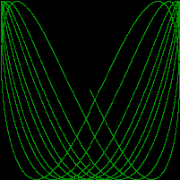

# Lissajous

Lissajous generates GIF animations of random [Lissajous figures](https://en.wikipedia.org/wiki/Lissajous_curve).

These are exercises 1.5 and 1.6 from the book The Go Programming Language by Brian W. Kernighan and Alan Donovan.

## Tasks

[ x ] Change the Lissajous program’s color palette to green on black, for added authenticity. To create the web color #RRGGBB, use color.RGBA{0xRR, 0xGG, 0xBB, 0xff}, where each pair of hexadecimal digits represents the intensity of the red, green, or blue component of the pixel.
